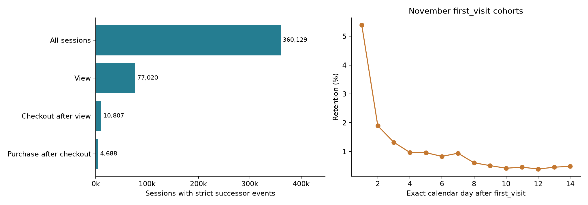
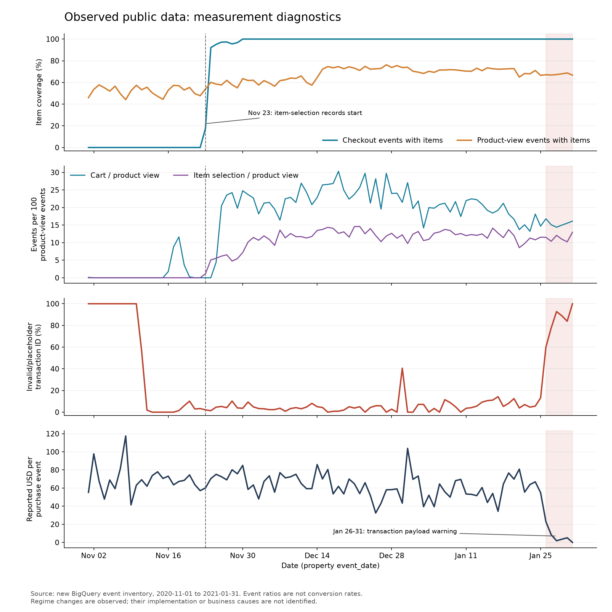
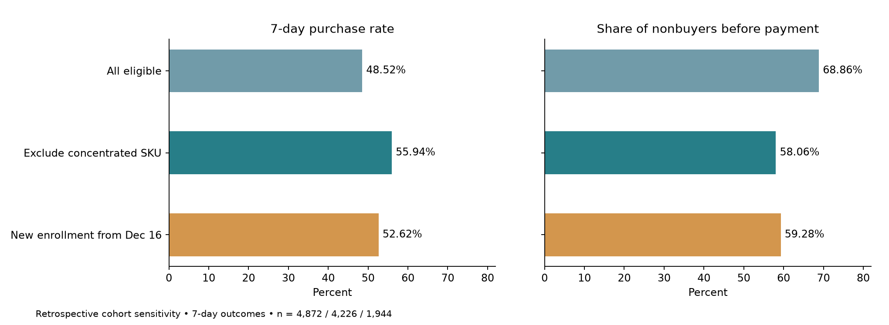

# 从用户行为到结算优化方向

本项目将基础指标分析收敛为一个可执行的判断：**先核查集中 SKU 异常及结算步骤记录，再验证全设备个人信息页简化。** 通过商品联接、时间敏感性和用户聚类推断，确认支付前路径具有稳定的优化优先级。

## 漏斗 留存与日度指标

`src/overview.py` 整合早期分析：以完整会话事实重算严格顺序漏斗、设备/来源指标和日度趋势，以原事件级 SQL 导出的 cohort 计数重算 D0–D14 留存。各比率从分子分母重新计算，汇总留存按人数加权。

- 漏斗采用嵌套的 `view → checkout → purchase`；`checkout / view` 等相互独立的边际计数比不作为阶段转化率。
- 设备/来源表以 checkout 会话为分母，购买与收入也限定在该人群。
- 留存分母为 cohort 内匿名 ID 数，分子为第 n 个自然日活跃的 cohort ID；D7 不表示七天内任意一天回访。
- 日度表将 session、purchase 次数和收入与 July 保存的导出对账；原始收入用于描述，交易质量研究进一步解释其可靠性。

November 首访 cohort 共 71,734 个匿名 ID，D1、D7、D14 加权留存分别为 **5.39%、0.94%、0.49%**。完整窗口严格事件路径为 **77,020 次浏览会话 → 10,807 次后续结算会话 → 4,688 次后续 purchase 会话**；此处采用事件购买口径，后续结算研究采用经济购买口径。92 日日度会话数、purchase 事件数与原始收入均与 July 导出逐日对齐。

## 测量稳定性先于归因

1 月 26 日后的购买记录出现零金额与占位商品载荷集中。因此完整 92 天用于发现变化，较稳定的 11 月 30 日至 1 月 25 日用于核心路径分析。切点探索服务于诊断，并不是预注册的显著性检验。

交易质量研究找到 450 条不满足当前经济购买定义的事件，以及 320 条候选重复多余记录。针对跨用户复用的交易 ID，采用用户、会话、金额与篮子联合匹配，提高交易口径的可靠性。原始口径、正金额有效商品口径和重复折叠口径共同呈现。

## 为什么选择支付前阶段

主用户基线包含 4,872 个窗口内首次 checkout 的匿名 ID，其中 2,364 个在随后完整七日内有经济购买记录，基线 48.52%。2,508 个未购者中，1,727 个没有在入组会话进入支付资料阶段，占 68.86%。

页面语义进一步确定：11,106 个 checkout 快照中，11,077 个位于 `/yourinfo.html`；`add_payment_info` 对应 `/payment.html`。checkout 与 shipping 又高度近同时发生，因此不把这两者之间的毫秒差解释为用户填写耗时。

## 商品联接怎样改变判断

646 个用户的首次 checkout 篮子仅有有效 SKU `9188192`，且商品类别全部缺失；这些用户均没有入组支付事件，也没有七日购买。该组合占原始“无支付且未购买”人数的 37.41%，会夸大普遍表单流失的解释。

| 分析人群 | 人数 | 七日购买率 | 无入组支付者占七日未购者 |
|---|---:|---:|---:|
| 原始首次 checkout 基线 | 4,872 | 48.52% | 68.86% |
| 排除集中商品组合 | 4,226 | 55.94% | 58.06% |
| 12 月 16 日重新开启入组窗 | 1,944 | 52.62% | 59.28% |

排除后的基线提高是样本组成变化，不是产品提升。支付前缺口在两种敏感性下仍然较大，支持保留该阶段作为优先调查方向。

## 为什么覆盖全部设备

稳定窗口 checkout 会话的经济购买率，移动端为 48.14%，桌面端为 46.52%；移动端减桌面端为 +1.62 个百分点，用户聚类 bootstrap 的 95% 区间为 [−0.89, +4.22] 个百分点。

进一步按周、国家、来源和事前历史做共同支持分层标准化。结果没有支持“移动端明显更差、首轮只做移动端”的优先级判断。实验覆盖全部设备，设备作为预先指定的分层与诊断维度。

设备比较采用观察性描述与用户聚类区间，服务于实验范围选择；设备作为正式实验的预设分层保留。

## 具体行动与取舍

先检查特定 SKU 流量、事件记录和真实订单链路，然后走查个人信息页。若真实页面存在可降低的输入负担，测试“必填项单列、浏览器自动填充、选填项折叠”的统一版本。首轮保持费用、优惠和支付规则一致，使处理含义清晰。

收益情景按“合格用户数 × 转化增量 × 单笔贡献 − 实施成本”计算，真实成本和利润率决定商业门槛。收益测算以合格流量和实验增量为基础。具体实验与上线规则见[实验设计](experiment.md)。

## 代码与结果对应

| 模块 | 主要输出 |
|---|---|
| `src/overview.py` | `results/overview/` 下的漏斗、留存、设备来源与日度表 |
| `src/measurement.py` | 时间分段、事件覆盖与记录漂移 |
| `src/transactions.py` | 交易质量标记、金额分布与商品结构 |
| `src/journeys.py` | 支付前路径、用户聚类 bootstrap 与设备标准化 |
| `src/merchandise.py` | SKU/页面语义、集中异常与篮子敏感性 |
| `src/sensitivity.py` | 独立重算主基线、排除与晚期重入组 |
