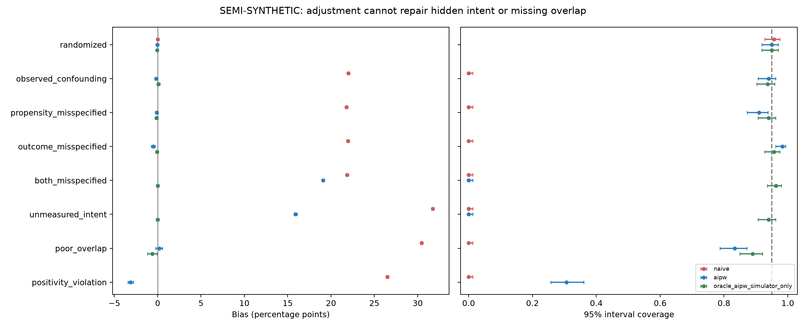

# 因果估计与方法验证

设备差异、渠道差异和支付路径差异都受用户意图与历史行为影响。项目用半合成数据比较朴素均值差、结果回归 OR、逆概率加权 IPW 与增广逆概率加权 AIPW，研究在什么条件下调整能够恢复目标效应。

## 目标与假设

对每个用户定义处理 A∈{0,1}、协变量 X、潜在结果 Y(0)、Y(1)，目标为 ATE=E[Y(1)−Y(0)]。用观察数据识别 ATE 需要一致性、给定 X 的条件可交换性与 positivity。识别假设决定估计目标，模型负责在该框架内完成调整。

倾向得分 e(X)=P(A=1|X)，结果模型 mₐ(X)=E[Y|A=a,X]。本项目使用 logistic regression，二折交叉拟合：对每一折，用另一折拟合倾向模型以及两个处理组的结果模型，然后只在留出折生成预测。

## 估计量

$$\widehat\tau_{IPW}=\frac1n\sum_i\left[\frac{A_iY_i}{\widehat e_i}-\frac{(1-A_i)Y_i}{1-\widehat e_i}\right].$$

这是未归一化的 Horvitz–Thompson 形式。OR 为两组预测潜在结果的均值差。AIPW 在 OR 基础上加入加权残差修正：

$$\widehat\tau_{AIPW}=\frac1n\sum_i\left[\widehat m_1(X_i)-\widehat m_0(X_i)+\frac{A_i(Y_i-\widehat m_1(X_i))}{\widehat e_i}-\frac{(1-A_i)(Y_i-\widehat m_0(X_i))}{1-\widehat e_i}\right].$$

在识别假设及相应正则条件下，倾向模型或结果模型任一正确可支持双重稳健点估计。二折交叉拟合减少同样本拟合与评价的耦合。程序对 AIPW 使用 score 的样本标准差除以 √n 得到标准误；OR/IPW 在本项目中是点估计比较基线，未提供其区间。

默认将倾向概率裁剪到 [0.01,0.99]，并在重叠场景比较 0.001 与 0.05。裁剪通过偏差与方差权衡提高数值稳定性；目标人群仍需具备处理与对照的共同支持。

## 半合成机制

从 4,872 人的真实基线提取入组前特征：历史会话、历史购买、设备、历史覆盖、session number、first-user organic medium 及缺失标记。真实 X 用于保留协变量结构，A 与 Y 由模拟器生成。

模拟器构造包含非线性项的购买风险，校准总体基线与已知平均处理效应。每个场景 300 次、每次 6,000 人；比较随机分流、可见混杂、单模型错设、双模型错设、未测意图、重叠不足和 positivity 违反。

| 场景 | AIPW 偏差，百分点 | 95% 区间覆盖率 | 含义 |
|---|---:|---:|---|
| 可见混杂 | −0.17 | 94.0% | 正确调整可消除大部分混杂偏差 |
| 结果模型错设 | −0.52 | 98.33% | 倾向模型提供修正，但区间行为需单独评价 |
| 两模型均错设 | +19.09 | 0% | 双重稳健不等于不需要正确模型 |
| 未测意图 | +15.91 | 0% | 遗漏共同原因时，调整可见变量仍有偏差 |
| 重叠不足 | +0.18 | 83.33% | 均值偏差较小也可能伴随不稳定区间 |

positivity 场景构造了一个更直接的反例：在确定接受处理或对照的区域，只改变永远无法观测的潜在结果，保持观察分布不变，但总体 ATE 改变。它说明缺乏支持是识别问题，而不只是数值不稳定。

## 诊断与解释

权重有效样本量 ESS=(Σw)²/Σw²，按处理组分别计算。SMD 比较加权协变量均值差，代码分母使用原始总体样本标准差。ESS、极端概率、裁剪比例和 SMD 帮助发现模型与支持问题，并配合未测混杂场景评估识别假设的敏感性。

汇总同时报告 bias、RMSE、经验标准差、平均估计标准误、覆盖率和拒绝零效应率。覆盖率和误报率同时附 Monte Carlo 标准误，量化有限重复次数的精度。

项目完成了从真实协变量、已知因果真值到估计量比较的验证体系，为随机实验的方法选择、混杂调整和诊断提供依据。

实现：[methods.py](../src/methods.py)、[validation.py](../src/validation.py)。参考：[Chernozhukov et al. Double/Debiased Machine Learning](https://arxiv.org/abs/1608.00060)。
